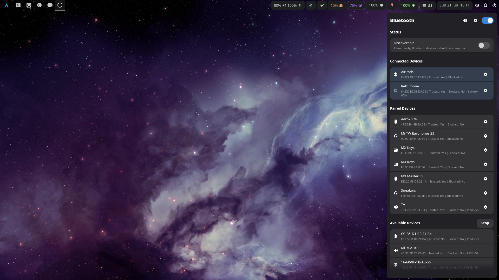

# Bluetooth Manager Sidebar



Native GTK4/libadwaita Bluetooth sidebar for Wayland desktops. It can be opened from the CLI, app launchers, hotkeys, or Waybar.

The app opens as a right-side layer-shell panel and provides quick access to Bluetooth adapter state, device pairing, connection controls, audio profiles, and OBEX file transfer.

## Features

- Toggle, show, hide, or quit the sidebar from repeated CLI invocations.
- View adapter power, discoverable state, pairing-agent status, and file-receiving status.
- Scan for Bluetooth devices and connect, disconnect, pair, trust, block, or remove devices.
- Send files to connected Bluetooth devices and authorize incoming file transfers.
- View device details including identity, connection state, battery, security, and audio profile information.
- Change Bluetooth audio profiles through `pactl` when available.

## Requirements

- GLib/GIO, including GIO Unix support.
- GTK 4 and libadwaita.
- `gtk4-layer-shell`.
- JSON-GLib.
- BlueZ on the system bus.
- BlueZ OBEX service on the session bus for file transfer.
- `pactl` for audio profile actions.
- `rfkill` for Bluetooth unblock recovery.

Gtk4LayerShell is required to show the sidebar.

Building from source also requires Meson, Ninja, pkg-config, a C compiler, and the development headers for the libraries above.

## Usage

Build and run from the repository checkout:

```sh
meson setup build
meson compile -C build
./bm-sidebar
```

The default command is `--toggle`. Additional commands are:

```sh
./bm-sidebar --toggle
./bm-sidebar --show
./bm-sidebar --hide
./bm-sidebar --quit
./bm-sidebar --reload-css
./bm-sidebar --background
```

`--show`, `--hide`, `--quit`, `--reload-css`, and the default `--toggle` send commands to an existing background process over a Unix socket. `--background` verifies an existing instance or starts one without showing the sidebar. If no running process is available, `--toggle`, `--show`, and `--background` start the GTK app. `--reload-css` requires an existing running instance.

Unlike lighter panels that can defer backend setup until first display, `--background` starts Bluetooth, pairing-agent, and OBEX receive integration so pairing prompts and incoming file-transfer authorization are available before the sidebar is shown.

The socket is created at `$XDG_RUNTIME_DIR/bm-sidebar.sock`, with a fallback under `/tmp/bm-sidebar-$UID/` when `XDG_RUNTIME_DIR` is not set. Runtime directories must be private, owned by the current user, and not symlinks.

Settings are stored at `$XDG_CONFIG_HOME/bm-sidebar/settings.json`. If `XDG_CONFIG_HOME` is unset, the app falls back to `~/.config/bm-sidebar/settings.json`.

## Waybar

Point a Waybar module at the executable, for example:

```json
"on-click": "/path/to/Bluetooth_Manager_Sidebar/bm-sidebar --toggle"
```

Use `--background` from your session startup if you want the command server running before the first click.

On multi-output setups, `bm-sidebar` uses Waybar's `WAYBAR_OUTPUT_NAME` environment variable when available. You can also force a connector with `BM_SIDEBAR_OUTPUT=eDP-1 bm-sidebar --toggle`.

## Native Packages

GitHub Actions builds native packages with Meson and nFPM for Debian/Ubuntu (`.deb`), Fedora/RHEL-family systems (`.rpm`), Arch Linux (`.pkg.tar.zst`), and Alpine Linux (`.apk`). Packages install the native CLI as `/usr/bin/bm-sidebar`, the GUI helper as `/usr/libexec/bm-sidebar/bm-sidebar-gui`, and application data under `/usr/share/bm-sidebar/`.

Users can override packaged styles by creating `$XDG_CONFIG_HOME/bm-sidebar/bm-sidebar.css`. If `XDG_CONFIG_HOME` is unset, the app falls back to `~/.config/bm-sidebar/bm-sidebar.css`. Use `bm-sidebar --reload-css` to apply user CSS changes to the running instance without quitting it.

GitHub Actions also publishes AUR source metadata for `bm-sidebar` when the `AUR_SSH_PRIVATE_KEY` GitHub secret is configured. It renders `packaging/aur/PKGBUILD.in` with the tag version and repository URL, computes the source checksum and `.SRCINFO` in an Arch Linux container, then pushes `PKGBUILD` and `.SRCINFO` to `ssh://aur@aur.archlinux.org/bm-sidebar.git`.

Native packages rely on distro-provided GLib 2.76 or newer, GTK 4.10 or newer, libadwaita 1.4 or newer, JSON-GLib, BlueZ, BlueZ OBEX, `gtk4-layer-shell`, `pactl`, and `rfkill`. Audio-profile dependency names vary by distro: Debian/Ubuntu and Fedora/RHEL-family packages use `pulseaudio-utils`, Arch Linux uses `libpulse`, and Alpine uses `pulseaudio-utils`. Arch Linux provides `rfkill` through `util-linux`.

## Project Layout

- `bm-sidebar`: checkout launcher for the Meson-built native CLI.
- `src/cli/`: command-line parsing, IPC probing, and GUI helper startup.
- `src/command/`: command socket protocol and startup command routing.
- `src/app/`: Adw application composition, GUI helper entrypoint, and page rendering.
- `src/sidebar/`: layer-shell window and sidebar chrome.
- `src/bluez/`: BlueZ state, adapter, device, discovery, and pairing integration.
- `src/obex/`: OBEX file transfer integration.
- `src/audio/`: audio profile integration through `pactl`.
- `src/settings/`: persisted settings storage.
- `bm-sidebar.css`: application styles.

## License

Bluetooth Manager Sidebar is licensed under the GNU General Public License v3.0 or later. See `LICENSE` for details.

## Development

There is currently no test-suite configuration. Use the focused checks below after edits.

```sh
meson setup build
meson compile -C build
./bm-sidebar --help
```

Check CLI wiring through the local launcher:

```sh
/home/relz/.local/bin/bm-sidebar --help
```

After changing the Waybar config, reload Waybar with:

```sh
pkill -SIGUSR2 -x waybar
```

When a Wayland graphical session is available, smoke-test the sidebar:

```sh
(./bm-sidebar --show & pid=$!; sleep 2; ./bm-sidebar --quit; wait $pid)
```

Build a native package locally with nFPM:

```sh
rm -rf build-package package-root dist
meson setup build-package --prefix=/usr --libdir=lib --buildtype=release
meson compile -C build-package
DESTDIR="$PWD/package-root" meson install -C build-package
mkdir -p dist
PACKAGE_VERSION=0.0.0 PACKAGE_RELEASE=1 PACKAGE_ARCH=amd64 PACKAGE_HOMEPAGE=https://github.com/Relz/bluetooth-manager-sidebar nfpm package --config packaging/nfpm.yaml --packager deb --target dist/
```
